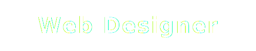

  <h1>Hi, I'm Arun T V.</h1>
  

    
  

  
Building clean, scalable, and intuitive digital experiences.

  
  

    
    
    
  

---

## 👨‍💻 About

I am a web developer with a strong focus on frontend architecture and user interface design. I enjoy turning complex problems into simple, beautiful, and intuitive designs. I am currently expanding my expertise in modern web development to build clean, production-ready applications.

*   **Focus:** Frontend Engineering, Responsive Design, User Experience
*   **Learning:** React, TypeScript, Figma
*   **Interests:** Minimalist design, open-source collaboration, performance optimization

---

## 🛠️ Tech Stack

   
  

 

---

## 🎯 Featured Projects

*   [**Creative Portfolio**](https://github.com/aruntv1407) — Building an interactive, personal showcase with a focus on UI/UX.
*   [**Web Experiments**](https://github.com/aruntv1407) — A minimal collection of front-end components and creative coding interfaces.

---

## 📊 GitHub Overview

  

 

  <em>"Design is not just what it looks like and feels like. Design is how it works."</em>

  <h1>Hi, I'm Arun T V.</h1>
  

    
  

  
Building clean, scalable, and intuitive digital experiences.

  
  

    
    
    
  

---

## ????? About

I am a web developer with a strong focus on frontend architecture and user interface design. I enjoy turning complex problems into simple, beautiful, and intuitive designs. I am currently expanding my expertise in modern web development to build clean, production-ready applications.

*   **Focus:** Frontend Engineering, Responsive Design, User Experience
*   **Learning:** React, TypeScript, Figma
*   **Interests:** Minimalist design, open-source collaboration, performance optimization

---

## ??? Tech Stack

   
  

 

---

## ?? Featured Projects

*   [**Creative Portfolio**](https://github.com/aruntv1407) � Building an interactive, personal showcase with a focus on UI/UX.
*   [**Web Experiments**](https://github.com/aruntv1407) � A minimal collection of front-end components and creative coding interfaces.

---

## ?? GitHub Overview

  

 

  <em>"Design is not just what it looks like and feels like. Design is how it works."</em>

